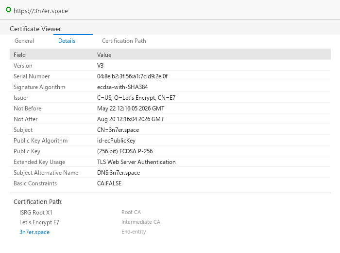
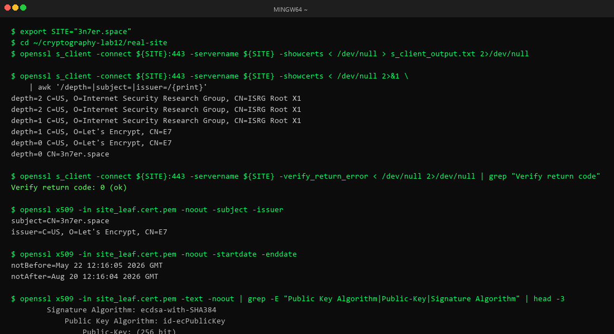
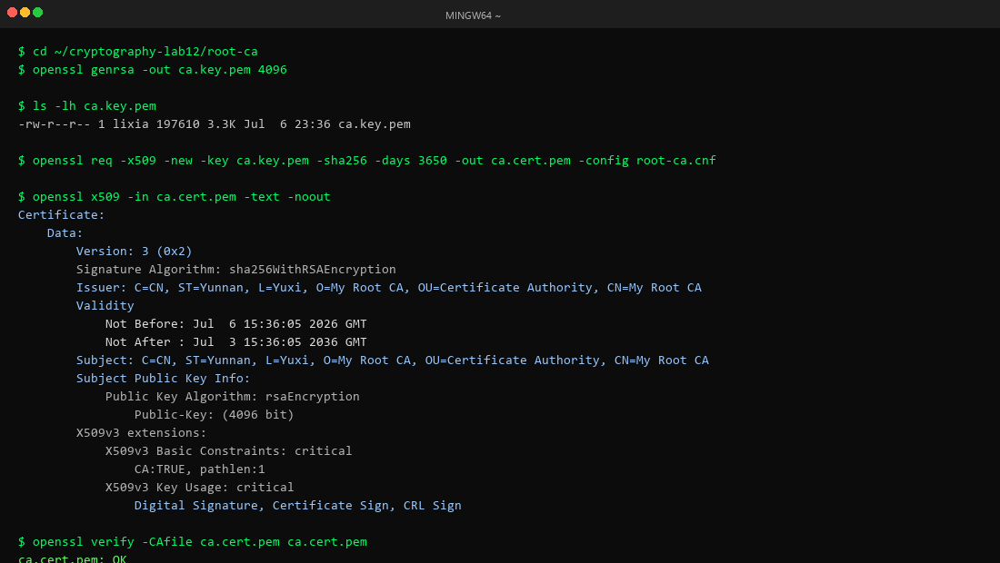
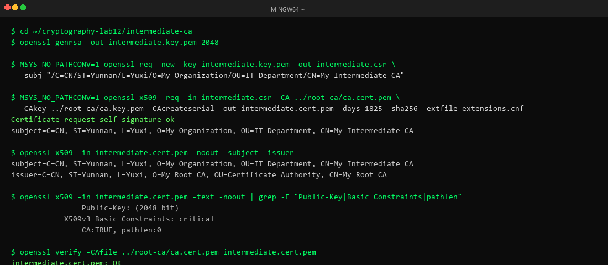
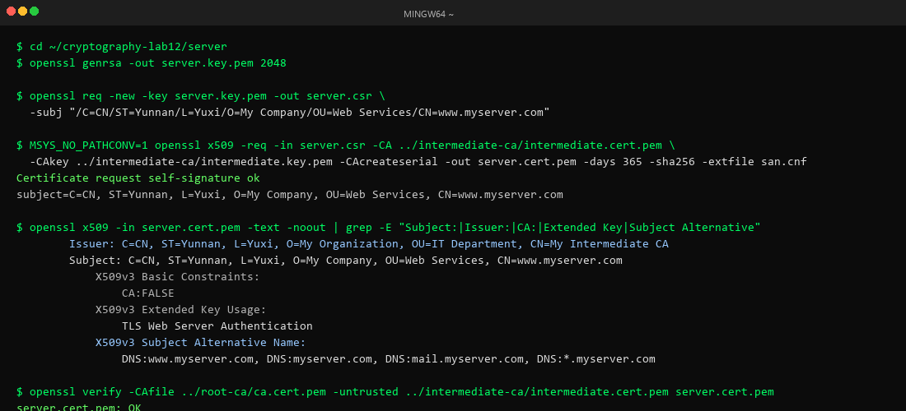
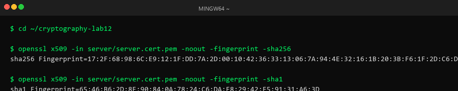

# Lab12：数字证书 —— 构建信任链的基石

## 实验简介

### 从数字签名到数字证书

在 Lab11 中，你已经学习了数字签名的原理和应用：使用私钥对消息签名，用公钥验证签名，数字签名提供了身份认证、完整性保护和不可否认性。

但数字签名有一个核心问题还没有解决：如何确认公钥本身是可信的？

**场景一：下载软件**

你从网站下载了一个软件安装包，网站提供了安装包、数字签名文件和公钥文件，并说"用公钥验证签名，确保软件未被篡改"。

但如果攻击者同时替换了软件、签名和公钥，你的验证仍然会通过——而你下载的是恶意软件。

**场景二：HTTPS 连接**

当你访问 https://www.example.com 时，服务器会发送它的公钥。如果攻击者能替换这个公钥，他就能冒充网站，窃取你的密码、信用卡信息等敏感数据。

### 数字证书的解决方案

数字证书通过引入可信第三方——证书颁发机构（Certificate Authority, CA）——来解决公钥分发问题：

1. CA 是一个被广泛信任的权威机构（如 DigiCert、Let's Encrypt）
2. CA 用自己的私钥对"网站的公钥 + 网站的身份信息"进行签名
3. 签名后的数据包就是"数字证书"
4. 操作系统和浏览器预装了 CA 的公钥（根证书）
5. 当你收到网站证书时，用 CA 的公钥验证签名
6. 如果验证通过，就可以信任证书中的网站公钥

一句话概括：

- **数字签名**解决"消息完整性和来源认证"
- **数字证书**解决"公钥本身的可信性"

### 证书的本质

数字证书 = 身份信息 + 公钥 + CA 的数字签名

```
┌──────────────────────────────────┐
│         数字证书的内容            │
├──────────────────────────────────┤
│ 版本号：V3                        │
│ 序列号：唯一标识                   │
│ 签名算法：SHA-256-RSA             │
│ 颁发者：CA 名称                   │
│ 有效期：2024-01-01 到 2025-01-01  │
│ 主题：网站/个人/组织的身份信息       │
│ 公钥：持有者的公钥                 │
│ 扩展字段：用途、域名等              │
├──────────────────────────────────┤
│      CA 的数字签名（对上述内容）    │
└──────────────────────────────────┘
```

### 信任链（Chain of Trust）

现实中，证书不是单层的，而是形成一条信任链：

```
根 CA 证书（Root CA）          ← 自签名，预装在操作系统中
    ↓ 用根 CA 私钥签名
中间 CA 证书（Intermediate CA） ← 由根 CA 签名，实际签发网站证书
    ↓ 用中间 CA 私钥签名
终端实体证书（End-entity）      ← 这就是网站的证书
```

为什么需要中间 CA？

- **安全性**：根 CA 的私钥保存在离线的高安全环境中，不直接签发网站证书
- **可撤销性**：中间 CA 的私钥泄露时，只需吊销该中间 CA，不影响根 CA
- **分工**：不同中间 CA 可负责不同业务领域

### 本次实验目标

完成本实验后，你应该能够：

- 理解 X.509 证书的结构和字段含义
- 观察真实 HTTPS 网站的证书链，并追溯到本机信任库中的根证书
- 构建私有证书链（根 CA → 中间 CA → 服务器证书）
- 理解证书验证过程中的每个步骤
- 掌握证书指纹的计算与用途
- 理解 PKI 体系中的 CRL 和 OCSP 机制

---

## 核心概念

### X.509 证书标准

X.509 是最广泛使用的数字证书标准，当前使用 v3 版本，主要字段如下：

| 字段 | 说明 |
|------|------|
| **版本（Version）** | v1 最初版本；v2 增加唯一标识符；v3 增加扩展字段，现代证书均为 v3 |
| **序列号（Serial Number）** | 由 CA 分配，唯一标识证书、引用吊销记录和防止重放攻击 |
| **签名算法（Signature Algorithm）** | CA 用于签名证书的算法，如 sha256WithRSAEncryption、ecdsa-with-SHA256 |
| **颁发者（Issuer）与主题（Subject）** | 均采用可分辨名称（DN）格式：C 国家、ST 省/州、L 城市、O 组织、OU 部门、CN 通用名称 |
| **有效期（Validity）** | Not Before（生效时间）和 Not After（过期时间） |
| **主题公钥信息** | 包含公钥算法（RSA、ECDSA、Ed25519）和实际公钥数值 |
| **扩展字段（Extensions）** | SAN、Key Usage、Extended Key Usage、Basic Constraints 等 |
| **CA 的数字签名** | 对所有字段的签名：编码 → 计算哈希 → 用 CA 私钥签名 → 附加到证书末尾 |

### 证书链的层次结构

```
┌────────────────────────────┐
│   根 CA 证书 (Root CA)      │  ← 自签名，预装在操作系统中，有效期 20-30 年
└────────────┬───────────────┘
             │ 用根 CA 私钥签名
             ↓
┌────────────────────────────┐
│ 中间 CA 证书 (Intermediate) │  ← 由根 CA 签名，有效期 5-10 年
└────────────┬───────────────┘
             │ 用中间 CA 私钥签名
             ↓
┌────────────────────────────┐
│ 终端实体证书 (End-entity)   │  ← 由中间 CA 签名，有效期 1-2 年（Let's Encrypt 90 天）
│ CN=www.example.com          │  ← Basic Constraints: CA=False，不能再签发其他证书
└────────────────────────────┘
```

### 证书验证的完整过程

当浏览器访问 https://www.example.com 时：

1. **检查有效期**：当前时间是否在 Not Before 和 Not After 之间
2. **检查域名匹配**：证书的 CN 或 SAN 字段是否匹配访问的域名
3. **验证证书链**：用中间 CA 公钥验证网站证书签名 → 用根 CA 公钥验证中间 CA 证书签名 → 根 CA 证书预装在系统中，自动信任
4. **检查吊销状态**：通过 CRL 或 OCSP 确认证书未被吊销
5. **检查证书用途**：Key Usage 和 Extended Key Usage 是否与使用场景匹配

### 证书指纹（Fingerprint）

计算方式：Fingerprint = Hash(整个证书的二进制数据)

| 算法 | 指纹长度 | 十六进制字符数 |
|------|----------|----------------|
| SHA-1 | 160 位 | 40 字符 |
| SHA-256 | 256 位 | 64 字符（推荐） |

主要用途：证书钉扎（Certificate Pinning）、证书比对、带外验证。

---

## 实验环境准备

```bash
$ openssl version
OpenSSL 3.5.6 7 Apr 2026 (Library: OpenSSL 3.5.6 7 Apr 2026)
```

实验目录结构：

```
~/cryptography-lab12/
├── root-ca/          # 根 CA 的密钥和证书
├── intermediate-ca/  # 中间 CA 的密钥和证书
├── server/           # 服务器（终端实体）的密钥和证书
└── real-site/        # 获取的真实网站证书
```

---

## 实验概览

本次实验分为两部分：

- **第一部分（任务一）**：观察真实公网网站的证书链，确认其能追溯到本机信任库中的根证书
- **第二部分（任务二～五）**：从零构建私有证书链（根 CA → 中间 CA → 服务器证书），并计算证书指纹

---

## 第一部分：观察真实网站证书链

本部分观察 `3n7er.space` 的证书链：

```bash
export SITE="3n7er.space"
```

### 任务一：观察真实网站证书链并追溯到本机根证书

#### 步骤 1：在浏览器中查看证书

在浏览器中打开 https://3n7er.space，点击地址栏左侧锁图标查看证书详情。

#### 步骤 2：使用 OpenSSL 获取证书

```bash
cd ~/cryptography-lab12/real-site

# 连接目标站点，保存完整 TLS 握手输出
openssl s_client -connect ${SITE}:443 -servername ${SITE} \
  -showcerts < /dev/null > s_client_output.txt 2>/dev/null

# 提取叶子证书
awk '
/-----BEGIN CERTIFICATE-----/ {in_cert=1}
in_cert {print}
/-----END CERTIFICATE-----/ {exit}
' s_client_output.txt > site_leaf.cert.pem
```

#### 步骤 3：查看证书详细信息

```bash
# 证书主题与颁发者
$ openssl x509 -in site_leaf.cert.pem -noout -subject -issuer
subject=CN=3n7er.space
issuer=C=US, O=Let's Encrypt, CN=E7

# 证书有效期
$ openssl x509 -in site_leaf.cert.pem -noout -startdate -enddate
notBefore=May 22 12:16:05 2026 GMT
notAfter=Aug 20 12:16:04 2026 GMT

# 公钥算法
$ openssl x509 -in site_leaf.cert.pem -text -noout | grep "Public Key Algorithm" | head -1
            Public Key Algorithm: id-ecPublicKey

# 公钥位数
$ openssl x509 -in site_leaf.cert.pem -text -noout | grep "Public-Key"
                Public-Key: (256 bit)

# 签名算法
$ openssl x509 -in site_leaf.cert.pem -text -noout | grep "Signature Algorithm" | head -1
        Signature Algorithm: ecdsa-with-SHA384

# 完整证书链层级
$ openssl s_client -connect ${SITE}:443 -servername ${SITE} -showcerts < /dev/null 2>&1 \
  | awk '/depth=|subject=|issuer=/{print}'
depth=2 C=US, O=Internet Security Research Group, CN=ISRG Root X1
depth=1 C=US, O=Let's Encrypt, CN=E7
depth=0 CN=3n7er.space
subject=CN=3n7er.space
issuer=C=US, O=Let's Encrypt, CN=E7

# 证书链层级数
$ openssl s_client -connect ${SITE}:443 -servername ${SITE} -showcerts < /dev/null 2>&1 \
  | awk '/depth=/{match($0,/depth=([0-9]+)/,m); print m[1]}' \
  | sort -nr | head -n1 | awk '{print "证书链层级数 = " $1+1}'
证书链层级数 = 3
```

#### 步骤 4：验证证书链

```bash
$ openssl s_client -connect ${SITE}:443 -servername ${SITE} \
  -verify_return_error < /dev/null 2>/dev/null | grep "Verify return code"
Verify return code: 0 (ok)
```

验证通过，说明网站的证书链能从服务器证书一路追溯到本机 OpenSSL 信任库中的根 CA（ISRG Root X1）。

#### 任务一结果表

| 项目 | 结果 |
|------|------|
| 访问的网站 | 3n7er.space |
| 证书主题（Subject） | CN=3n7er.space |
| 证书颁发者（Issuer） | C=US, O=Let's Encrypt, CN=E7 |
| 证书有效期（起始-结束） | 2026-05-22 12:16:05 GMT - 2026-08-20 12:16:04 GMT |
| 公钥算法 | id-ecPublicKey（ECDSA，256 位） |
| 签名算法 | ecdsa-with-SHA384 |
| 证书链层级数 | 3 |
| 根 CA 名称 | C=US, O=Internet Security Research Group, CN=ISRG Root X1 |
| OpenSSL 验证结果（Verify return code） | 0 (ok) |
| 是否为公开 CA / 第三方 CA 签发 | 是（Let's Encrypt） |

**截图：**





---

## 第二部分：构建私有证书链

### 总体流程

```
任务二                    任务三                      任务四
────────────────────      ─────────────────────────   ─────────────────────────────
生成根 CA 私钥             生成中间 CA 私钥              生成服务器私钥
       ↓                          ↓                           ↓
创建根 CA 自签名证书        生成 CSR（向根 CA 申请）        生成 CSR（向中间 CA 申请）
  ca.key.pem                      ↓                           ↓
  ca.cert.pem            根 CA 私钥签名 → 中间 CA 证书    中间 CA 私钥签名 → 服务器证书
                           intermediate.key.pem            server.key.pem
                           intermediate.cert.pem           server.cert.pem
```

信任关系：

```
ca.cert.pem（根 CA，自签名，信任起点）
    └── intermediate.cert.pem（中间 CA，由根 CA 签名）
            └── server.cert.pem（服务器证书，由中间 CA 签名）
```

### 任务二：创建私有自签名根 CA 证书

#### 步骤 1：生成根 CA 私钥

```bash
$ cd ~/cryptography-lab12/root-ca
$ openssl genrsa -out ca.key.pem 4096

$ ls -lh ca.key.pem
-rw-r--r-- 1 lixia 197610 3.3K Jul  6 23:36 ca.key.pem
```

#### 步骤 2：生成自签名根 CA 证书

配置文件 `root-ca.cnf`：

```ini
[req]
distinguished_name = dn
x509_extensions = v3_ca
prompt = no

[dn]
C = CN
ST = Yunnan
L = Yuxi
O = My Root CA
OU = Certificate Authority
CN = My Root CA

[v3_ca]
basicConstraints = critical, CA:TRUE, pathlen:1
keyUsage = critical, digitalSignature, cRLSign, keyCertSign
subjectKeyIdentifier = hash
authorityKeyIdentifier = keyid:always,issuer
```

生成证书：

```bash
$ openssl req -x509 -new -key ca.key.pem -sha256 -days 3650 \
  -out ca.cert.pem -config root-ca.cnf
```

#### 步骤 3：查看并验证根 CA 证书

```bash
$ openssl x509 -in ca.cert.pem -text -noout
Certificate:
    Data:
        Version: 3 (0x2)
        Serial Number:
            5e:74:7a:80:b8:f3:29:50:d6:fd:01:ef:24:22:83:f7:1d:a6:d8:b7
        Signature Algorithm: sha256WithRSAEncryption
        Issuer: C=CN, ST=Yunnan, L=Yuxi, O=My Root CA, OU=Certificate Authority, CN=My Root CA
        Validity
            Not Before: Jul  6 15:36:05 2026 GMT
            Not After : Jul  3 15:36:05 2036 GMT
        Subject: C=CN, ST=Yunnan, L=Yuxi, O=My Root CA, OU=Certificate Authority, CN=My Root CA
        Subject Public Key Info:
            Public Key Algorithm: rsaEncryption
                Public-Key: (4096 bit)
        X509v3 extensions:
            X509v3 Basic Constraints: critical
                CA:TRUE, pathlen:1
            X509v3 Key Usage: critical
                Digital Signature, Certificate Sign, CRL Sign
            X509v3 Subject Key Identifier:
                F6:ED:91:BF:F2:0A:5B:E7:0A:A7:FA:77:A9:6D:04:85:3E:A0:97:C3
            X509v3 Authority Key Identifier:
                F6:ED:91:BF:F2:0A:5B:E7:0A:A7:FA:77:A9:6D:04:85:3E:A0:97:C3

$ openssl verify -CAfile ca.cert.pem ca.cert.pem
ca.cert.pem: OK
```

Issuer 和 Subject 完全相同 → 自签名证书的标志。Basic Constraints: CA:TRUE, pathlen:1 → 这是 CA 证书，且最多允许一层中间 CA。RSA Public-Key: (4096 bit) → 确认密钥长度。

**截图：**



---

### 任务三：创建私有中间 CA 并由根 CA 签发

#### 步骤 1：生成中间 CA 私钥

```bash
$ cd ~/cryptography-lab12/intermediate-ca
$ openssl genrsa -out intermediate.key.pem 2048
```

#### 步骤 2：创建证书签名请求（CSR）

```bash
$ MSYS_NO_PATHCONV=1 openssl req -new -key intermediate.key.pem -out intermediate.csr \
  -subj "/C=CN/ST=Yunnan/L=Yuxi/O=My Organization/OU=IT Department/CN=My Intermediate CA"
```

#### 步骤 3：用根 CA 签发中间 CA 证书

扩展配置文件 `extensions.cnf`：

```ini
basicConstraints = critical, CA:TRUE, pathlen:0
keyUsage = critical, digitalSignature, cRLSign, keyCertSign
```

根 CA 签名：

```bash
$ MSYS_NO_PATHCONV=1 openssl x509 -req -in intermediate.csr \
  -CA ../root-ca/ca.cert.pem -CAkey ../root-ca/ca.key.pem \
  -CAcreateserial -out intermediate.cert.pem -days 1825 -sha256 -extfile extensions.cnf
Certificate request self-signature ok
subject=C=CN, ST=Yunnan, L=Yuxi, O=My Organization, OU=IT Department, CN=My Intermediate CA
```

#### 步骤 4：查看并验证中间 CA 证书

```bash
$ openssl x509 -in intermediate.cert.pem -noout -subject -issuer
subject=C=CN, ST=Yunnan, L=Yuxi, O=My Organization, OU=IT Department, CN=My Intermediate CA
issuer=C=CN, ST=Yunnan, L=Yuxi, O=My Root CA, OU=Certificate Authority, CN=My Root CA

$ openssl x509 -in intermediate.cert.pem -text -noout | grep -E "Public-Key|Basic Constraints|pathlen"
                Public-Key: (2048 bit)
            X509v3 Basic Constraints: critical
                CA:TRUE, pathlen:0

$ openssl verify -CAfile ../root-ca/ca.cert.pem intermediate.cert.pem
intermediate.cert.pem: OK
```

Issuer 为根 CA 的 Subject，Subject 为中间 CA 自身 → 由根 CA 签名。Basic Constraints: CA:TRUE, pathlen:0 → 只能签发终端实体证书。

**截图：**



#### 根 CA 与中间 CA 证书对比

```bash
$ echo "===== 根 CA =====" && \
  openssl x509 -in ~/cryptography-lab12/root-ca/ca.cert.pem -noout \
    -subject -issuer -dates
subject=C=CN, ST=Yunnan, L=Yuxi, O=My Root CA, OU=Certificate Authority, CN=My Root CA
issuer=C=CN, ST=Yunnan, L=Yuxi, O=My Root CA, OU=Certificate Authority, CN=My Root CA
notBefore=Jul  6 15:36:05 2026 GMT
notAfter=Jul  3 15:36:05 2036 GMT

$ echo "===== 中间 CA =====" && \
  openssl x509 -in ~/cryptography-lab12/intermediate-ca/intermediate.cert.pem -noout \
    -subject -issuer -dates
subject=C=CN, ST=Yunnan, L=Yuxi, O=My Organization, OU=IT Department, CN=My Intermediate CA
issuer=C=CN, ST=Yunnan, L=Yuxi, O=My Root CA, OU=Certificate Authority, CN=My Root CA
notBefore=Jul  6 15:36:21 2026 GMT
notAfter=Jul  5 15:36:21 2031 GMT
```

| 对比项 | 根 CA 证书 | 中间 CA 证书 |
|--------|-----------|-------------|
| 如何产生 | openssl req -x509（直接自签名） | openssl req -new 生成 CSR，再由根 CA 用 openssl x509 -req 签发 |
| 谁来签名 | 自己签自己 | 根 CA 私钥签名 |
| Issuer = Subject？ | 是（自签名的标志） | 否（Issuer 是根 CA） |
| 密钥长度 | 4096 位 | 2048 位 |
| 有效期 | 3650 天（10 年） | 1825 天（5 年） |
| basicConstraints | CA:TRUE, pathlen:1 | CA:TRUE, pathlen:0 |
| 能否签发其他证书 | 能（最多一层子 CA） | 能（只能签终端证书） |

---

### 任务四：签发私有服务器证书

#### 步骤 1：生成服务器私钥

```bash
$ cd ~/cryptography-lab12/server
$ openssl genrsa -out server.key.pem 2048
```

#### 步骤 2：创建服务器 CSR

```bash
$ openssl req -new -key server.key.pem -out server.csr \
  -subj "/C=CN/ST=Yunnan/L=Yuxi/O=My Company/OU=Web Services/CN=www.myserver.com"
```

#### 步骤 3：创建 SAN 配置文件

`san.cnf`：

```ini
basicConstraints = CA:FALSE
keyUsage = nonRepudiation, digitalSignature, keyEncipherment
extendedKeyUsage = serverAuth
subjectAltName = @alt_names

[alt_names]
DNS.1 = www.myserver.com
DNS.2 = myserver.com
DNS.3 = mail.myserver.com
DNS.4 = *.myserver.com
```

#### 步骤 4：中间 CA 签发服务器证书

```bash
$ MSYS_NO_PATHCONV=1 openssl x509 -req -in server.csr \
  -CA ../intermediate-ca/intermediate.cert.pem \
  -CAkey ../intermediate-ca/intermediate.key.pem \
  -CAcreateserial -out server.cert.pem -days 365 -sha256 -extfile san.cnf
Certificate request self-signature ok
subject=C=CN, ST=Yunnan, L=Yuxi, O=My Company, OU=Web Services, CN=www.myserver.com
```

#### 步骤 5：查看、拼接并验证

```bash
$ openssl x509 -in server.cert.pem -text -noout
Certificate:
    Data:
        Version: 3 (0x2)
        Signature Algorithm: sha256WithRSAEncryption
        Issuer: C=CN, ST=Yunnan, L=Yuxi, O=My Organization, OU=IT Department, CN=My Intermediate CA
        Validity
            Not Before: Jul  6 15:36:41 2026 GMT
            Not After : Jul  6 15:36:41 2027 GMT
        Subject: C=CN, ST=Yunnan, L=Yuxi, O=My Company, OU=Web Services, CN=www.myserver.com
        Subject Public Key Info:
            Public Key Algorithm: rsaEncryption
                Public-Key: (2048 bit)
        X509v3 extensions:
            X509v3 Basic Constraints:
                CA:FALSE
            X509v3 Key Usage:
                Digital Signature, Non Repudiation, Key Encipherment
            X509v3 Extended Key Usage:
                TLS Web Server Authentication
            X509v3 Subject Alternative Name:
                DNS:www.myserver.com, DNS:myserver.com, DNS:mail.myserver.com, DNS:*.myserver.com

# 拼接完整证书链文件
$ cat server.cert.pem ../intermediate-ca/intermediate.cert.pem > server-chain.cert.pem

# 验证完整三级证书链
$ openssl verify -CAfile ../root-ca/ca.cert.pem \
  -untrusted ../intermediate-ca/intermediate.cert.pem \
  server.cert.pem
server.cert.pem: OK
```

**截图：**



#### 服务器证书与 CA 证书对比

```bash
$ for cert in \
  ~/cryptography-lab12/root-ca/ca.cert.pem \
  ~/cryptography-lab12/intermediate-ca/intermediate.cert.pem \
  ~/cryptography-lab12/server/server.cert.pem; do
  echo "===== $cert ====="
  openssl x509 -in "$cert" -noout -subject -issuer -dates
  openssl x509 -in "$cert" -text -noout 2>/dev/null \
    | grep -E "Public-Key|Basic Constraints|pathlen|CA:|Key Usage|Extended Key Usage|Subject Alternative"
  echo ""
done
```

| 对比项 | 根 CA 证书 | 中间 CA 证书 | 服务器证书 |
|--------|-----------|-------------|-----------|
| basicConstraints | CA:TRUE, pathlen:1 | CA:TRUE, pathlen:0 | CA:FALSE |
| extendedKeyUsage | 无 | 无 | serverAuth |
| SAN | 无 | 无 | 有（4 个域名） |
| 密钥长度 | 4096 位 | 2048 位 | 2048 位 |
| 有效期 | 3650 天 | 1825 天 | 365 天 |
| Issuer | = Subject（自签名） | 根 CA | 中间 CA |
| 生成方式 | req -x509 | req -new → x509 -req | req -new → x509 -req |

---

### 任务五：计算证书指纹

```bash
$ cd ~/cryptography-lab12

# SHA-256 指纹
$ openssl x509 -in server/server.cert.pem -noout -fingerprint -sha256
sha256 Fingerprint=17:2F:68:98:6C:E9:12:1F:DD:7A:2D:00:10:42:36:33:13:06:7A:94:4E:32:16:1B:20:3B:F6:1F:2D:C6:DE:79

# SHA-1 指纹
$ openssl x509 -in server/server.cert.pem -noout -fingerprint -sha1
sha1 Fingerprint=65:46:B6:2D:8E:90:84:0A:78:24:C6:DA:E8:29:42:E5:91:31:A6:3D
```

**截图：**



---

## 实验结果

### A. 真实网站证书（任务一）

已在任务一结果表中填写，此处无需重复。

### B. 私有根 CA 证书（任务二）

| 项目 | 结果 |
|------|------|
| 证书主题（Subject） | C=CN, ST=Yunnan, L=Yuxi, O=My Root CA, OU=Certificate Authority, CN=My Root CA |
| 证书颁发者（Issuer） | C=CN, ST=Yunnan, L=Yuxi, O=My Root CA, OU=Certificate Authority, CN=My Root CA |
| 主题和颁发者是否相同 | 是（自签名证书） |
| 证书有效期（天数） | 3650 天（约 10 年） |
| 公钥长度（位） | 4096 |
| Basic Constraints 中 CA 字段的值 | CA:TRUE, pathlen:1 |

### C. 私有中间 CA 证书（任务三）

| 项目 | 结果 |
|------|------|
| 证书主题（Subject） | C=CN, ST=Yunnan, L=Yuxi, O=My Organization, OU=IT Department, CN=My Intermediate CA |
| 证书颁发者（Issuer） | C=CN, ST=Yunnan, L=Yuxi, O=My Root CA, OU=Certificate Authority, CN=My Root CA |
| pathlen 值 | 0 |
| 证书有效期（天数） | 1825 天（约 5 年） |

### D. 私有服务器证书（任务四）

| 项目 | 结果 |
|------|------|
| 证书主题（Subject） | C=CN, ST=Yunnan, L=Yuxi, O=My Company, OU=Web Services, CN=www.myserver.com |
| 证书颁发者（Issuer） | C=CN, ST=Yunnan, L=Yuxi, O=My Organization, OU=IT Department, CN=My Intermediate CA |
| CA 字段的值 | CA:FALSE |
| Extended Key Usage | TLS Web Server Authentication（serverAuth） |
| SAN 中包含的域名数量 | 4（www.myserver.com, myserver.com, mail.myserver.com, *.myserver.com） |
| 是否支持通配符域名 | 是（*.myserver.com） |

### E. 证书指纹（任务五）

| 项目 | 结果 |
|------|------|
| SHA-256 指纹（完整） | 17:2F:68:98:6C:E9:12:1F:DD:7A:2D:00:10:42:36:33:13:06:7A:94:4E:32:16:1B:20:3B:F6:1F:2D:C6:DE:79 |
| SHA-1 指纹（完整） | 65:46:B6:2D:8E:90:84:0A:78:24:C6:DA:E8:29:42:E5:91:31:A6:3D |

### F. 真实 PKI 与私有 PKI 对比

| 对比项 | 真实公网 PKI（3n7er.space） | 本实验私有 PKI |
|--------|---------------------------|---------------|
| 最终信任根 | ISRG Root X1（系统预装） | My Root CA（自建 ca.cert.pem） |
| 浏览器默认是否信任 | 是 | 否（需手动安装根证书） |
| 证书签发者是否为第三方 CA | 是（Let's Encrypt） | 否（自建 CA） |
| 适合的使用场景 | 公网 HTTPS 网站、面向公众的服务 | 企业内网、开发测试、教学实验 |

---

## 思考题

### 1. 数字证书的本质

**数字证书的本质是什么？它解决了什么问题？为什么单独的数字签名不够，还需要数字证书？**

> **答：**
>
> **数字证书的本质**是一个经过可信第三方（CA）数字签名的数据结构，它将身份信息与公钥绑定在一起。其核心公式为：数字证书 = 身份信息 + 公钥 + CA 的数字签名。
>
> **它解决的问题**是公钥分发中的信任问题——即"如何确认收到的公钥确实属于声称的持有者"。这被称为公钥的"可信性"问题。
>
> **为什么单独的数字签名不够：**
>
> 数字签名能保证消息的完整性、身份认证和不可否认性，但它有一个前提假设——验证方已经可靠地拥有了发送者的公钥。然而在开放网络中，公钥本身也需要通过不安全的信道传输。如果攻击者在传输过程中替换了公钥（中间人攻击），那么：
>
> 1. 攻击者生成自己的密钥对
> 2. 用自己的私钥对恶意消息签名
> 3. 将恶意消息、签名和自己的公钥一起发送给受害者
> 4. 受害者用收到的（攻击者的）公钥验证签名 → 验证通过
> 5. 受害者误以为消息来自真正的发送者
>
> 数字签名验证的是"签名与公钥的匹配关系"，但无法验证"公钥与身份的绑定关系"。数字证书通过引入 CA 这一可信第三方来弥补这个缺口：CA 对"公钥 + 身份信息"进行签名，只要我们信任 CA，就能信任证书中绑定的公钥。

---

### 2. 自签名证书 vs CA 签名证书

**什么是自签名证书？为什么浏览器会警告自签名证书不安全？在什么场景下可以使用自签名证书？**

> **答：**
>
> **自签名证书**是指证书的颁发者（Issuer）和主题（Subject）相同，即证书持有者用自己的私钥对自己的公钥和身份信息进行签名。本实验中创建的根 CA 证书就是自签名的。
>
> **浏览器警告自签名证书不安全的原因：**
>
> 自签名证书缺少可信第三方的担保。任何人都可以生成自签名证书并声称自己是任何域名的主人——攻击者可以生成一张 CN=www.google.com 的自签名证书。浏览器无法区分"真正的 Google 自签名证书"和"攻击者伪造的自签名证书"，因此默认拒绝信任，向用户发出安全警告。这并不是说自签名证书在密码学上有缺陷，而是它的信任来源无法被验证。
>
> **可以使用自签名证书的场景：**
>
> 1. **开发与测试环境**：本地开发 HTTPS 功能时，不需要购买正式证书
> 2. **内部基础设施**：企业内网的服务间通信（如微服务之间的 mTLS），内部设备可预配置信任
> 3. **根 CA 证书**：PKI 体系中的根 CA 证书本身就是自签名的，它的信任通过"预装到操作系统/浏览器信任库"来建立
> 4. **私有 PKI**：本实验构建的私有证书链，在明确指定 ca.cert.pem 为信任根时可信
> 5. **IPSec/VPN 内部通信**：封闭网络环境中的设备认证

---

### 3. 证书链的必要性

**为什么需要证书链（根 CA → 中间 CA → 终端实体证书）？为什么不让根 CA 直接签发所有终端实体证书？**

> **答：**
>
> 证书链的必要性体现在以下三个方面：
>
> **1. 安全性（保护根 CA 私钥）**
>
> 根 CA 是整个 PKI 体系的信任根基，其私钥一旦泄露，所有依赖它的证书都将不可信。因此根 CA 的私钥通常保存在离线的硬件安全模块（HSM）中，存放在物理隔离的高安全环境里，极少被使用。如果根 CA 直接签发所有终端证书，就需要频繁使用私钥进行签名操作，大大增加了私钥泄露的风险。通过引入中间 CA，根 CA 只需签名少量中间 CA 证书，日常签发工作由中间 CA 承担。
>
> **2. 可撤销性（隔离风险）**
>
> 如果某个中间 CA 的私钥泄露，只需吊销该中间 CA 的证书，由它签发的终端证书随之失效，但根 CA 和其他中间 CA 不受影响。如果根 CA 直接签发所有证书且私钥泄露，整个 PKI 体系将崩溃，需要全球所有设备更新信任库——这在 2011 年 DigiNotar 事件中真实发生过，代价极其惨重。
>
> **3. 分工与效率**
>
> 不同中间 CA 可以负责不同业务领域或地理区域。例如一个中间 CA 负责亚洲区业务，另一个负责欧洲区；一个负责 DV 证书签发，另一个负责 EV 证书。这种分工使证书管理更加灵活高效，也便于合规审计。

---

### 4. 根 CA 证书的信任

**根 CA 证书是自签名的，为什么我们会信任它？操作系统和浏览器如何决定信任哪些根 CA？**

> **答：**
>
> **信任根 CA 证书的原因：**
>
> 根 CA 证书虽然是自签名的（自己给自己担保），但它之所以被信任，不是因为密码学上的验证，而是因为**人工审核和预装机制**。这是一个"信任锚"（Trust Anchor）的概念——总有一个信任起点是无法通过密码学证明的，只能通过制度和社会共识来建立。
>
> **操作系统和浏览器决定信任哪些根 CA 的流程：**
>
> 1. **CA 机构申请**：CA 机构（如 DigiCert、Let's Encrypt）向浏览器厂商或操作系统厂商提交加入信任库的申请
> 2. **严格审计**：CA 必须通过 WebTrust（或 ETSI）等国际标准的审计，证明其安全实践符合规范，包括物理安全、密钥管理、身份验证流程等
> 3. **技术审查**：厂商审查 CA 的技术基础设施、证书签发策略（CPS）、历史安全记录等
> 4. **列入信任库**：审核通过后，CA 的根证书被预装到操作系统（如 Windows 的证书存储、macOS 的钥匙串）和浏览器（如 Firefox 有自己独立的信任库）中
> 5. **持续监控**：加入后仍受持续监督，如果 CA 出现安全事故（如 DigiNotar 被攻击、赛门铁克审计不合格），会被从信任库中移除
>
> 这意味着普通用户信任根 CA 是因为信任操作系统/浏览器厂商的审核能力，而厂商的审核依据是国际标准和专业审计——这是一个层层传递的社会信任体系，而非纯密码学机制。

---

### 5. pathlen 的作用

**中间 CA 证书中的 pathlen:0 是什么意思？如果 pathlen:1，会有什么区别？**

> **答：**
>
> **pathlen 的含义：**
>
> pathlen（路径长度约束）是 Basic Constraints 扩展中的一个字段，用于限制在该 CA 之下还可以存在多少层 CA 证书。它控制证书链的最大深度，防止链条无限延伸。
>
> - **pathlen:0**：该 CA 可以签发终端实体证书，但**不能**再签发下一层 CA 证书。也就是说，在它下面不允许有任何子 CA，只能有终端证书。本实验中中间 CA 的 pathlen 设为 0，确保它只能签发服务器证书，不能再创建子 CA。
>
> - **pathlen:1**：该 CA 下面还可以有**一层** CA 证书。也就是说，它可以签发一个子 CA，那个子 CA 只能签发终端证书（子 CA 的 pathlen 必须为 0）。本实验中根 CA 的 pathlen 设为 1，允许存在一层中间 CA。
>
> **如果中间 CA 的 pathlen 改为 1：**
>
> 中间 CA 将可以再签发一层子 CA（即"二级中间 CA"），证书链变成四层：根 CA → 中间 CA → 二级中间 CA → 终端证书。这增加了灵活性但也扩大了攻击面——如果中间 CA 私钥泄露，攻击者可以创建假 CA 来签发更多伪造证书。pathlen:0 的设计正是为了封死这条路，体现最小权限原则。

---

### 6. 证书过期

**如果一个网站的证书过期了，会发生什么？为什么证书需要有效期限制？为什么 Let's Encrypt 的证书只有 90 天有效期？**

> **答：**
>
> **证书过期后会发生什么：**
>
> 浏览器会显示"您的连接不是私密连接"或类似的安全警告，阻止用户访问。浏览器检查证书的 Not After 字段，发现当前时间已超过有效期，认为该证书不再可信。用户必须手动点击"继续前往"才能访问（不推荐），或者网站管理员需要续期证书。
>
> **为什么需要有效期限制：**
>
> 1. **限制密钥使用时间**：即使私钥被泄露，攻击者利用窗口也有限
> 2. **强制定期更新**：推动网站使用最新的加密算法和安全实践
> 3. **便于撤销**：过期证书自动失效，无需依赖吊销机制
> 4. **轮换密钥**：定期更换密钥对，降低长期累积的安全风险
> 5. **更新身份信息**：域名所有权、组织信息可能变化，定期重新验证
>
> **Let's Encrypt 证书只有 90 天的原因：**
>
> 1. **降低泄密损失**：90 天的有效期意味着即使私钥泄露，攻击窗口最多 90 天
> 2. **推动自动化**：短有效期迫使网站使用 ACME 协议自动续期，减少人工操作出错（Let's Encrypt 的核心理念就是自动化）
> 3. **快速淘汰旧算法**：如果发现某个算法有漏洞，短有效期使全网能快速迁移到更安全的配置
> 4. **减少吊销依赖**：证书很快自然过期，减少对 CRL/OCSP 吊销机制的依赖（这些机制在实际中并不完善）
> 5. **行业趋势**：CA/B 论坛已将证书最长有效期从 398 天逐步缩短，未来可能进一步缩短至 90 天甚至更短

---

### 7. 证书吊销

**什么情况下需要吊销证书？CRL 和 OCSP 有什么区别？**

> **答：**
>
> **需要吊销证书的情况：**
>
> 1. **私钥泄露**：证书对应的私钥被盗或可能被盗
> 2. **域名所有权变更**：域名转手给新所有者，旧证书应失效
> 3. **CA 被入侵**：CA 签发了不该签发的证书（如 DigiNotar 事件）
> 4. **证书信息错误**：证书中的身份信息有误，需要重新签发
> 5. **业务终止**：网站停止运营，证书不再需要
> 6. **取代（Superseded）**：新证书取代了旧证书
>
> **CRL 和 OCSP 的区别：**
>
> | 对比项 | CRL（证书吊销列表） | OCSP（在线证书状态协议） |
> |--------|---------------------|------------------------|
> | 全称 | Certificate Revocation List | Online Certificate Status Protocol |
> | 机制 | CA 定期发布一个被吊销证书的序列号列表，客户端下载后本地查询 | 客户端实时向 CA 的 OCSP 服务器查询某张证书的当前状态 |
> | 数据格式 | 一个包含所有被吊销证书的完整列表 | 针对单张证书的实时状态响应（good/revoked/unknown） |
> | 更新频率 | 定期发布（如每天、每周），存在时间窗口 | 实时响应，状态最新 |
> | 带宽消耗 | 列表可能很大，下载开销高 | 每次只查询一张证书，开销小 |
> | 隐私问题 | 下载整个列表，不泄露用户访问行为 | 查询请求暴露用户正在访问哪个网站（隐私泄露） |
> | 缓存 | 客户端可缓存整个列表 | 可缓存响应，但有有效期 |
> | 改进方案 | — | OCSP Stapling：服务器在 TLS 握手时附带 OCSP 响应，解决隐私和性能问题 |

---

### 8. Subject Alternative Name

**为什么现代证书通常包含 SAN 扩展？SAN 和 CN 有什么区别？**

> **答：**
>
> **为什么需要 SAN 扩展：**
>
> 早期 X.509 证书使用 CN（Common Name）字段来标识证书对应的域名。但 CN 有几个严重局限：
> 1. **一张证书只能对应一个域名**（通过 CN），无法支持多域名
> 2. **CN 字段的语义不明确**——它可能是域名、人名、设备名，浏览器需要猜测
> 3. **国际化和通配符支持差**
>
> SAN（Subject Alternative Name）扩展解决了这些问题，它允许一张证书明确列出所有覆盖的域名，包括不同域名、通配符域名甚至 IP 地址。
>
> **SAN 和 CN 的区别：**
>
> | 对比项 | CN（Common Name） | SAN（Subject Alternative Name） |
> |--------|-------------------|-------------------------------|
> | 位置 | 证书的 Subject 字段中的一个子字段 | X.509 v3 扩展字段 |
> | 域名数量 | 只能放一个域名 | 可以放任意多个域名 |
> | 浏览器支持 | 现代浏览器**忽略** CN 中的域名 | 现代浏览器**只看** SAN |
> | 标准状态 | 已废弃用于域名匹配 | CA/B Forum 强制要求 |
> | 本实验示例 | CN=www.myserver.com | DNS:www.myserver.com, DNS:myserver.com, DNS:mail.myserver.com, DNS:*.myserver.com |
>
> 自 2017 年起，CA/B Forum 规范要求所有新签发的证书必须包含 SAN 字段，CN 中的域名不再被浏览器检查。如果一张证书没有 SAN，现代浏览器会报"证书对此域名无效"。

---

### 9. 证书指纹的用途

**证书指纹是如何计算的？什么是证书钉扎（Certificate Pinning）？**

> **答：**
>
> **证书指纹的计算方式：**
>
> 指纹 = Hash(整个证书的 DER 编码二进制数据)
>
> 具体过程：将证书文件从 PEM 格式解码为 DER 格式（原始二进制），然后对全部字节计算哈希（SHA-256 或 SHA-1），输出即为指纹。指纹不是证书中的一个字段，而是临时计算出来的，用于唯一标识一张证书。
>
> - SHA-256 指纹：64 个十六进制字符（256 位），推荐使用
> - SHA-1 指纹：40 个十六进制字符（160 位），因碰撞风险已不推荐
>
> **证书钉扎（Certificate Pinning）：**
>
> 证书钉扎是一种安全机制：应用程序在首次连接时（或通过预置/更新）记录下服务器证书的指纹，后续每次连接时都比对服务器证书的指纹是否与预存值一致。如果指纹不匹配（即使新证书是合法 CA 签发的），连接也会被拒绝。
>
> **钉扎解决的问题：** 即使攻击者通过入侵 CA 或欺骗 CA 获得了一张合法的伪造证书，指纹也对不上，攻击仍然会被阻止。2011 年 DigiNotar 事件中，如果 Google 钉扎了自己的证书指纹，伊朗用户的 Gmail 流量就不会被监听。
>
> **钉扎的局限：** 证书更新时需要同步更新钉扎的指纹，否则合法的证书轮换会导致连接失败。因此现代实践通常钉扎 CA 的公钥哈希而非终端证书本身，并支持多个备用钉扎值。

---

### 10. 通配符证书

**通配符证书（如 *.example.com）可以匹配哪些域名？它有什么局限性？**

> **答：**
>
> **通配符证书可以匹配的域名：**
>
> `*.example.com` 可以匹配 `example.com` 的**一级子域名**，例如：
> - ✅ www.example.com
> - ✅ mail.example.com
> - ✅ api.example.com
> - ✅ 任意一级子域名
>
> **通配符证书的局限性：**
>
> 1. **只能匹配一级子域名**：`*.example.com` 不能匹配 `a.b.example.com`（二级子域名），也不能匹配 `example.com` 本身（裸域名需要单独列出）
> 2. **所有子域名共享一张证书**：如果某个子域名的服务器被攻破，攻击者可以使用同一张证书在其他子域名上实施中间人攻击
> 3. **通配符证书签发审核更严格**：CA 对通配符证书的域名控制权验证（通常使用 DNS-01）要求更高，费用也可能更高
> 4. **EV 证书不支持通配符**：扩展验证（EV）证书不允许使用通配符，因为 EV 要求精确的身份验证
> 5. **证书吊销影响范围大**：一张通配符证书被吊销，所有子域名同时失效
>
> 在本实验中，SAN 同时包含了具体域名（www.myserver.com、myserver.com、mail.myserver.com）和通配符域名（*.myserver.com），这样既覆盖了已知的子域名，又能灵活支持未来新增的子域名。

---

### 11. 证书透明度

**什么是证书透明度（Certificate Transparency, CT）？它解决了什么问题？**

> **答：**
>
> **证书透明度（Certificate Transparency, CT）** 是一个公开审计的证书日志系统，由 Google 提出。它要求 CA 将签发的每一张证书提交到公开的、只能追加（append-only）的 CT 日志中，任何人都可以查询和监控这些日志。
>
> **CT 解决的问题：**
>
> 在 CT 出现之前，CA 的签发行为是不透明的——没有任何人（包括域名所有者）能知道某个 CA 是否为自己的域名签发了证书。这意味着：
>
> 1. **流氓证书难以被发现**：如果 CA 被入侵或恶意签发了一张 google.com 的证书，Google 自己都不知道，直到攻击发生
> 2. **CA 的不当行为无法追踪**：没有记录证明某个 CA 签发了多少不该签的证书
>
> **CT 的工作机制：**
>
> 1. CA 签发证书后，将证书提交到一个或多个 CT 日志服务器
> 2. 日志服务器返回一个签名时间戳（SCT），证明证书已被记录
> 3. SCT 被嵌入到证书中（作为扩展字段）或在 TLS 握手中传递
> 4. 浏览器检查证书是否包含 SCT，没有 SCT 的证书会被拒绝（Chrome 要求 EV 证书必须包含 SCT，2018 年起所有新证书都必须包含）
> 5. 域名所有者可以监控 CT 日志，发现有人为自己的域名签发未授权证书时立即报警
>
> **CT 的意义：**
>
> - DigiNotar 事件如果有 CT，攻击者签发的 *.google.com 证书会立即出现在公开日志中，Google 能在攻击发生前就发现并吊销
> - CT 使 CA 的行为完全透明可审计，大幅提升了 PKI 生态的安全性

---

### 12. Let's Encrypt 的工作原理

**结合 3n7er.space 的证书链，说明 Let's Encrypt 是如何免费签发证书的？ACME 协议如何验证域名控制权？为什么 Let's Encrypt 证书有效期较短并依赖自动续期？**

> **答：**
>
> **3n7er.space 的证书链结构：**
>
> ```
> ISRG Root X1（根 CA，自签名，预装在系统中）
>     └── Let's Encrypt E7（中间 CA，ECDSA）
>             └── 3n7er.space（终端证书，ECDSA P-256）
> ```
>
> 证书链终点是 ISRG Root X1，这是操作系统预装的根证书，因此浏览器默认信任。
>
> **Let's Encrypt 如何免费签发证书：**
>
> Let's Encrypt 是一个非营利 CA，通过 ACME（Automated Certificate Management Environment）协议实现完全自动化的证书签发流程，免去了人工审核的成本：
>
> 1. 客户端（如 certbot）生成密钥对，向 Let's Encrypt 注册账户
> 2. 客户端申请域名的证书，Let's Encrypt 返回一个验证挑战（Challenge）
> 3. 客户端完成挑战，证明对域名的控制权
> 4. Let's Encrypt 验证通过后，用中间 CA（如 E7）的私钥签名签发证书
> 5. 证书通过 HTTPS 返回给客户端，整个过程全自动
>
> 资金来源是赞助商捐款（Mozilla、Cisco、Google 等），不向用户收费。
>
> **ACME 协议验证域名控制权的方式：**
>
> - **HTTP-01 验证**：Let's Encrypt 要求客户端在 `http://<域名>/.well-known/acme-challenge/<token>` 放置一个特定文件，CA 通过 HTTP 请求验证该文件内容。适合大多数 Web 服务器。
> - **DNS-01 验证**：客户端在域名的 DNS 中添加一条特定的 TXT 记录，CA 查询 DNS 验证。适合通配符证书和无法开放 HTTP 的场景。
> - **TLS-ALPN-01 验证**：通过 TLS 握手携带验证信息，适合只有 443 端口可用的场景。
>
> **为什么证书有效期较短（90 天）并依赖自动续期：**
>
> 1. **安全边际**：短有效期限制了私钥泄露的攻击窗口
> 2. **推动自动化**：90 天有效期使得手动续期不现实，强制用户采用自动化工具（certbot 等），减少人为错误
> 3. **减少吊销依赖**：证书很快自然过期，不需要完善的吊销基础设施
> 4. **快速迭代**：便于全网快速采用新的安全标准和算法
> 5. **行业趋势**：CA/B Forum 正在推动缩短证书有效期，Let's Encrypt 走在前面

---

### 13. 真实 PKI 与私有 PKI

**为什么浏览器默认信任 3n7er.space 的 Let's Encrypt 证书，却不信任本实验签发的服务器证书？两者在证书格式、证书链结构和信任根上有哪些相同点和不同点？**

> **答：**
>
> **浏览器默认信任 3n7er.space 而不信任本实验证书的根本原因：**
>
> 信任根不同。3n7er.space 的证书链终点是 ISRG Root X1，这是操作系统/浏览器预装的根证书，浏览器无条件信任。而本实验的根 CA（My Root CA）是自建的，没有经过任何 CA/B Forum 审计，也没有预装到任何操作系统的信任库中，浏览器自然不信任。
>
> **相同点：**
>
> | 对比项 | 真实 PKI | 私有 PKI |
> |--------|---------|---------|
> | 证书格式 | X.509 v3 | X.509 v3 |
> | 证书链结构 | 三层（根→中间→终端） | 三层（根→中间→终端） |
> | 签名机制 | 上级 CA 私钥签名下级证书 | 上级 CA 私钥签名下级证书 |
> | 验证过程 | 逐级验证签名追溯到根 | 逐级验证签名追溯到根 |
> | Basic Constraints | 根 pathlen:1，中间 pathlen:0，终端 CA:FALSE | 根 pathlen:1，中间 pathlen:0，终端 CA:FALSE |
> | Extended Key Usage | 终端证书含 serverAuth | 终端证书含 serverAuth |
> | SAN 字段 | 有 | 有 |
>
> **不同点：**
>
> | 对比项 | 真实 PKI（3n7er.space） | 私有 PKI（本实验） |
> |--------|------------------------|-------------------|
> | 信任根 | ISRG Root X1（系统预装） | My Root CA（未预装） |
> | 浏览器是否信任 | 是 | 否 |
> | 公钥算法 | ECDSA P-256 | RSA 2048 |
> | 签名算法 | ecdsa-with-SHA384 | sha256WithRSAEncryption |
> | 有效期 | 90 天 | 365 天 |
> | CA 审计 | 通过 WebTrust 审计 | 无审计 |
> | CT 日志 | 证书已提交 CT 日志 | 未提交 |
> | 域名验证 | ACME 协议自动验证 | 手动指定 |
> | 适用场景 | 公网 HTTPS | 内网/开发/教学 |
>
> **结论：** 两者在密码学结构和证书格式上完全相同，差异仅在于信任根是否被预装。这恰恰说明了 PKI 的核心——信任不是密码学问题，而是社会工程问题。密码学提供的是验证手段（签名、哈希），而信任的建立依赖于制度（审计、预装、监管）。

---

## 常见问题

**Q1：unable to get local issuer certificate**

原因：验证时没有提供完整的证书链。解决：确保同时指定 `-CAfile`（根 CA）和 `-untrusted`（中间 CA）。

**Q2：浏览器不信任私有证书**

原因：根 CA 证书未安装到系统信任存储中（这是正常的，本实验是私有 PKI）。

**Q3：CN 和 SAN 不匹配**

原因：现代浏览器优先检查 SAN，忽略 CN。解决：确保 `san.cnf` 中包含所有需要的域名。

---

## 提交要求

```
学号姓名/
└── Lab12/
    ├── Lab12.md                    ← 本文件（填写完整）
    ├── browser_cert.png            ← 浏览器证书截图
    ├── openssl_cert.png            ← OpenSSL 证书截图
    ├── root_ca.png                 ← 根 CA 截图
    ├── intermediate_ca.png         ← 中间 CA 截图
    ├── server_cert.png             ← 服务器证书截图
    └── fingerprint.png             ← 证书指纹截图
```

---

## 截止时间

2026-07-06，届时关于 Lab12 的 PR 请求将不再被合并。

---

**实验愉快！🔐**
